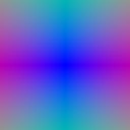
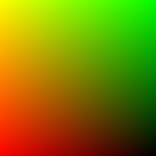
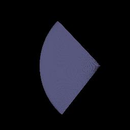
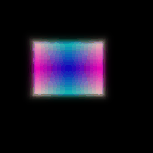
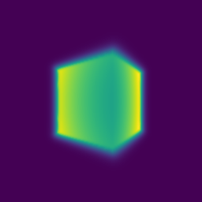
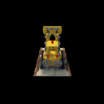

# Assignment 3 README

This document provides the necessary commands to run each part of Assignment 3 and indicates where the results will be saved.

## Execution Instructions

Ensure you are in the correct directory where the `main.py` script is located before running these commands.

### Part 1.3: 2D XY Grid and Rays Visualization

```
python main.py --config-name=box
```




### Part 1.4: Sampling Points Visualization

```
python main.py --config-name=box
```


### Part 1.5: Depth Visualization

```
python main.py --config-name=box
```



### Part 2: Training Visualization

```
python main.py --config-name=train_box
```
### Part 3: NeRF Lego Visualization

```
python main.py --config-name=nerf_lego
```

